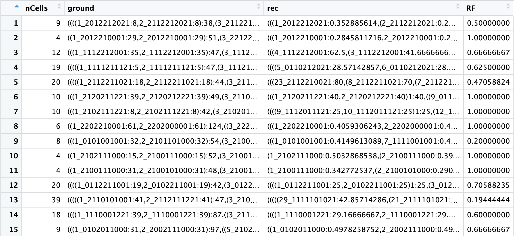

```{r setup, include=FALSE}
knitr::opts_chunk$set(echo = TRUE)
```

### Allen Institute Cell Lineage Reconstruction DREAM Challenge

## Subchallenge 1: Reconstruction of cellular lineage trees from DNA-based recording of mutations


This recording system relies on the activity of viral integrases to perform irreversible edits on DNA arrays that can be read out using imagining. For details on the method see [Frieda et al 2016](https://www.nature.com/articles/nature20777). This updated version of the MEMOIR system enables 3 different states for each recording unit. Experimental data comprises lineage recording on mouse stem cells with a copy of a 10 unit array. Each unit starts at state “1” and can transition into a deletion “0” or a reverse event “2”. The recording is irreversible, therefore, once a recording unit transitions into either of the two edited states, it becomes stable. In this experiment, we traced the growth of 106 colonies, each started from an individual cell. The array state for the founder cell at t=0 is s = [1111111111], the recording is then induced for 48hrs.

**Assumptions:**
The mutation rate is assumed to be constant per unit of time, but this is not necessarily true. The recording is assuming to last for 48hrs, induction is then stopped but some enzyme could still be active inside the cells and some units can still switch state. For an edit event, we assume that the probability of going into either 0 or 2 is equal, but data shows otherwise.


### Data

We provide recording data for 100 trees. For each tree, there is a list of cell IDs and the readout e.g.

Cell | Barcode
---- | -------
23   | 0021011201  
24   | 0011012200

The **Barcode** column contains the recording for each cell. This is *all information* available for reconstruction of the lineage. 

***

A main file named training_data.tsv contains all information needed to reconstruct, train and validate. 

* ***nCells*** The number of cells that survided for whole experiment and hence have readout i.e. The number of leafs in the tree

* ***ground*** The actual tree, this is the ground truth validated using a time lapse of the growing colony of cells. Newick format.

* ***rec*** The reconstructed lineage using the sister-likelihood method. Newick format. 

* ***RF*** [Normalized Robinson-Foulds](https://www.rdocumentation.org/packages/phangorn/versions/2.5.5/topics/treedist) distance between the ground truth and reconstruction. 1 means perfect reconstruction. 0 means random guess. 


### An example of reconstruction

```{r loadlib, echo=T, results='hide', message=F, warning=F}
library(phangorn)
library(phytools)

```

```{r eval=FALSE}
training_data = read.table("training_data.tsv")
```

```{r echo=FALSE}
training_data = read.table("/Users/alejandrog/MEGA/Caltech/trees/GraceData/10mer_2019/training_data.tsv")
```

We can for example select tree number 3

```{r}
ground_truth_string = training_data[3,]$ground

# convert it to a tree object using the phytools library 

ground_truth = read.newick(text = as.character(ground_truth_string))

plot(ground_truth)
```

As an example, we can see how well we can reconstruct this tree using the sister-likelihood method.

```{r eval=FALSE}
# All functions necessary to calculate the likelihood and reconstruct the tree
# NOTE: it loads multiple libraries, make sure to install them before running the script
source("memoirReconstruction.R")


```

The script estimates the edit rates and mutation parameters from the data then we will use those parameters to calculate the likelihood that two cells are sisters based on a model of stochastic mutations. For a full description of the method see [1]()
```{r echo=FALSE, results='hide', message=F, warning=F}
source("/Users/alejandrog/MEGA/Caltech/trees/GraceData/memoirReconstruction.R")
```


We can run the function reconstructLineage on the phylo object. This function will take the barcode information from the leaves of the tree, then process the barcodes and output a new tree that was reconstructed from the likelihood model. 

```{r}
reconstruction = reconstructLineage(ground_phylo = ground_truth,mu = mu, alpha = alpha , return_tree = T  )

plot(reconstruction,main = "Reconstructed tree")
```


### How to compare a reconstruction vs the real lineage

Once you have reconstructed the lineage you can calcualte the score using the RF.dist function 

```{r}
RF = RF.dist(ground_truth,reconstruction,normalize=T)

score = 1-RF

score
```