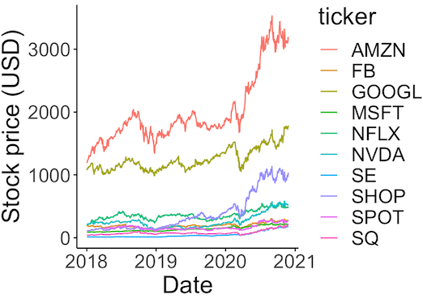
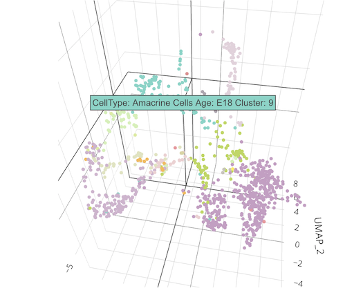
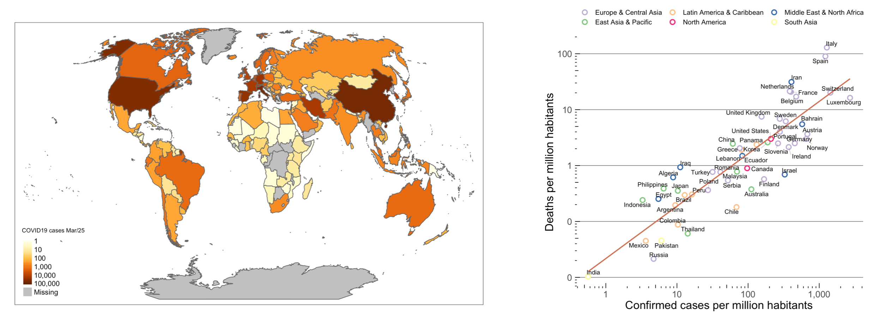

```{r setup, include=FALSE}
knitr::opts_chunk$set(echo = TRUE)
```

 


# Summary

I am postdoctoral scholar at the California Institute of Technology working at Michael Elowitz' laboratory. My main projects relate to single-cell RNA sequencing data analysis at the level of signaling pathways in developmental contexts. 
In this website I collect data related projects, academic work and photography and other non-academic projects. 

---

<br><br>

# **Latest posts**

## *Retrieving stock prices data from Yahoo Finance* 

***

[](https://agranado.github.io/FinanceData.html)

<br><br>


## *Making an interactive 3D UMAP plot* 

***

[](https://agranado.github.io/UMAP_3d.html)

<br><br>

## *EDA and visualization of COVID19 pandemia across the world* 

***

[](https://agranado.github.io/COVID19_analysis.html)


## *Clubes de Ciencia, Mexico.* 

***

A hands-on Data Science intro for undergrads using Single-Cell RNA seq data. 

[](https://agranado.github.io/CdC2019.html)


