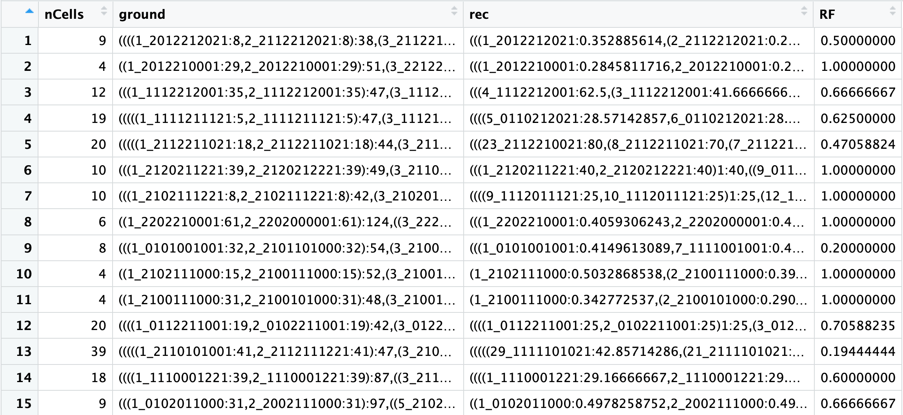

```{r setup, include=FALSE}
knitr::opts_chunk$set(echo = TRUE)
```


 
 
## intMEMOIR enables in situ developmental lineage reconstruction.

<br>
intMEMOIR is a digital, image-readable lineage recording system developed in the Elowtiz lab at Caltech. The system introduces a novel design based on a dense multi-state memory array that can be edited by serine integrases and integrated at defined genomic sites for germline heritability, allowing its use in diverse organisms and contexts. This design generates diverse, digital, irreversible edits states that can be stably inherited over many cell cycles and then read out by smFISH alongside endogenous transcripts. 
<br><br>


   


The intMEMOIR recording system relies on the activity of viral integrases to perform irreversible edits on DNA arrays that can be read out using imaging. For details on the experimental methods see [Chow et al 2020](https://www.nature.com/articles/nature20777). A mutation by the Bxb1 integrase can  MEMOIR system enables 3 different states for each recording unit. 

<br>
The experimental data comprises lineage recording on mouse stem cells that have been engineering to carry a copy of a 10 unit intMEMOIR array (intMEM1 cell line). At the start of the experiment, all units in the array are on state “1” (unedited) and, as cells divice, stochastic recording can edit units into a either: “0” (deletion) or “2” (reversed). Each recording event is irreversible, therefore, the information recorded by intMEMOIR is not lost upon continued recording. 

<br>
The experimental data presented here refers to Figure 3 of the intMEMOIR manuscript, where we traced the growth of 106 colonies, each starting from an individual cell. The array state for the founder cell at t=0 is s = [1111111111], intMEMOIR recording is then induced for 48hrs.

<br>
To reconstruct a multi-generation lineage tree from observed edit patterns, we first develop a relatedness metric for pairs of cells (or clones) based on their edit patterns. The metric is based on the likelihood of a sister relationship. We then use this metric to reconstruct lineage trees in such a way that cells that score higher on this sister likelihood metric are grouped more closely together on the reconstructed tree. Finally, we validate this procedure and quantify its accuracy.

<br><br>

 
Fig2. intMEM1 cells are tracked in time-lapse microscopy to establish ground truth lineage relationships (left panel). End-point FISH analysis recovers array edit state (second panel). Distinct edit patters are used to classify cells into clones ('clonal classification', color groups), or further analyzed based on sister likelihood distance. See more details in our [preprint](https://www.biorxiv.org/content/10.1101/2020.02.21.958678v1.full).
 <br><br>


### Data
***


We provide recording data for 100 trees. For each tree, there is a list of cell IDs and the readout e.g.

Cell | Barcode
---- | -------
23   | 0021011201  
24   | 0011012200

The **Barcode** column contains the recording for each cell. This is *all information* available for reconstruction of the lineage. 

***
<br>
A main file named training_data.tsv contains all information needed to reconstruct, train and validate. <br>


* ***nCells*** The number of cells that survided for whole experiment and hence have readout i.e. The number of leafs in the tree

* ***ground*** The actual tree, this is the ground truth validated using a time lapse of the growing colony of cells. Newick format.

* ***rec*** The reconstructed lineage using the sister-likelihood method. Newick format. 

* ***RF*** [Normalized Robinson-Foulds](https://www.rdocumentation.org/packages/phangorn/versions/2.5.5/topics/treedist) distance between the ground truth and reconstruction. 1 means perfect reconstruction. 0 means random guess. 

<br><br><br>

### An example of reconstruction

***

```{r loadlib, echo=T, results='hide', message=F, warning=F}
library(phangorn)
library(phytools)

```

```{r eval=FALSE}
training_data = read.table("training_data.tsv")
```

```{r echo=FALSE}
training_data = read.table("/Users/alejandrog/MEGA/Caltech/trees/GraceData/10mer_2019/training_data.tsv")
```

We can for example select tree number 3

```{r}
ground_truth_string = training_data[3,]$ground

# convert it to a tree object using the phytools library 

ground_truth = read.newick(text = as.character(ground_truth_string))

plot(ground_truth)
```

As an example, we can see how well we can reconstruct this tree using the sister-likelihood method.

```{r eval=FALSE}
# All functions necessary to calculate the likelihood and reconstruct the tree
# NOTE: it loads multiple libraries, make sure to install them before running the script
source("memoirReconstruction.R")


```

The script estimates the edit rates and mutation parameters from the data then we will use those parameters to calculate the likelihood that two cells are sisters based on a model of stochastic mutations. For a full description of the method see [1]()
```{r echo=FALSE, results='hide', message=F, warning=F}
source("/Users/alejandrog/MEGA/Caltech/trees/GraceData/memoirReconstruction.R")
```


We can run the function `reconstructLineage` on the phylo object. This function will take the barcode information from the leaves of the tree, then process the barcodes and output a new tree that was reconstructed from the likelihood model. 

```{r}
reconstruction = reconstructLineage(ground_phylo = ground_truth,mu = mu, alpha = alpha , return_tree = T  )

plot(reconstruction,main = "Reconstructed tree")
```

<br><br><br>


### How to compare a reconstruction vs the real lineage

***

Once you have reconstructed the lineage you can calcualte the score using the `RF.dist` function 

```{r}
RF = RF.dist(ground_truth,reconstruction,normalize=T)

score = 1-RF

score
```


Sometimes, however, we want to visually compare the lineage trees. We can use the library `dendextend` to achieve this. 


```{r,message=F, warning=F}

library(gridExtra)
library(dendextend)
library(ggdendro)
library(ggplot2)

grid.arrange(
    ggdendrogram( as.hclust(force.ultrametric(ground_truth)),rotate = T ) +  labs(title="Ground truth") ,
    ggdendrogram(as.hclust(reconstruction),rotate=T) + labs(title="Reconstruction"),
                            ncol = 2)
```

As you can see comparing two dendrograms by eye is not optimal. We can plot a [tanglegram](https://www.rdocumentation.org/packages/dendextend/versions/1.12.0/topics/tanglegram) using `dendextend`. 
```{r,message=F, warning=F}

list_dend = dendlist( as.dendrogram(force.ultrametric(ground_truth)) ,   
                      as.dendrogram(as.hclust(reconstruction)))

 # Find the best alignment layout  + Draw the two dendrograms
list_dend %>% 
    untangle(method = "step1side") %>% 
              tanglegram(sort=T,type="r",dLeaf_right = 0,dLeaf_left = -10,margin_inner = 7,highlight_branches_lwd = FALSE)                       


```